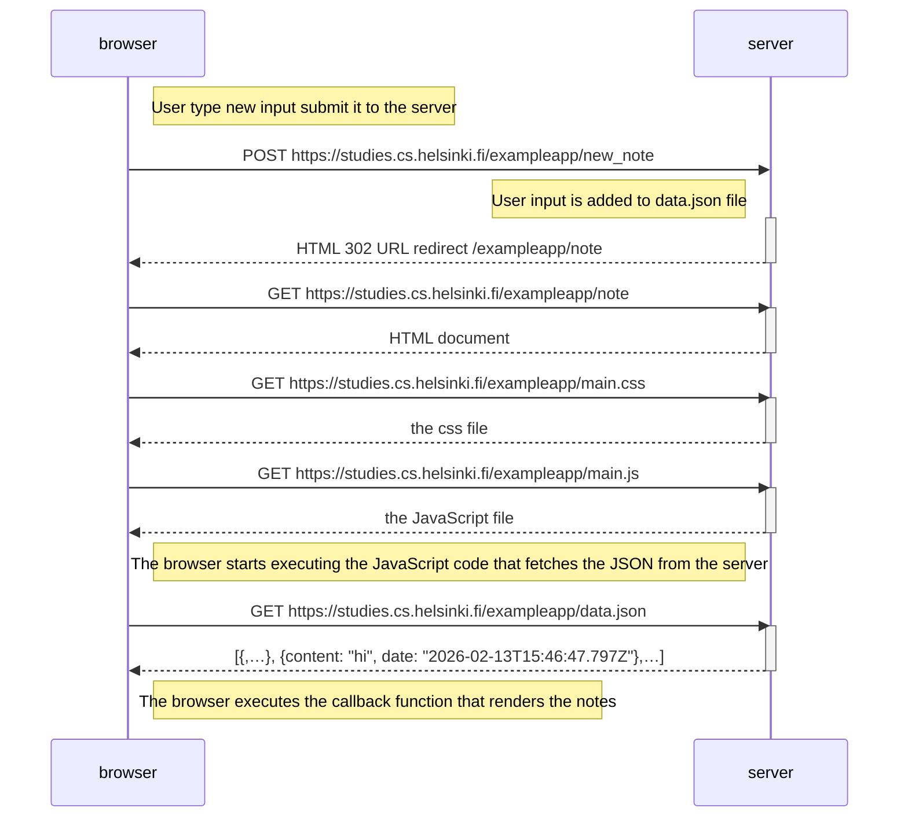

```mermaid
sequenceDiagram
    participant browser
    participant server

    Note right of browser: User type new input submit it to the server

    browser->>server: POST https://studies.cs.helsinki.fi/exampleapp/new_note
   
   Note left of server: User input is added to data.json file
   
    activate server
    server-->>browser: HTML 302 URL redirect /exampleapp/note
    deactivate server

    browser->>server: GET https://studies.cs.helsinki.fi/exampleapp/note
    activate server
    server-->>browser: HTML document
    deactivate server

    browser->>server: GET https://studies.cs.helsinki.fi/exampleapp/main.css
    activate server
    server-->>browser: the css file
    deactivate server

    browser->>server: GET https://studies.cs.helsinki.fi/exampleapp/main.js
    activate server
    server-->>browser: the JavaScript file
    deactivate server

    Note right of browser: The browser starts executing the JavaScript code that fetches the JSON from the server

    browser->>server: GET https://studies.cs.helsinki.fi/exampleapp/data.json
    activate server
    server-->>browser: [{,…}, {content: "hi", date: "2026-02-13T15:46:47.797Z"},…]
    deactivate server

    Note right of browser: The browser executes the callback function that renders the notes
```
