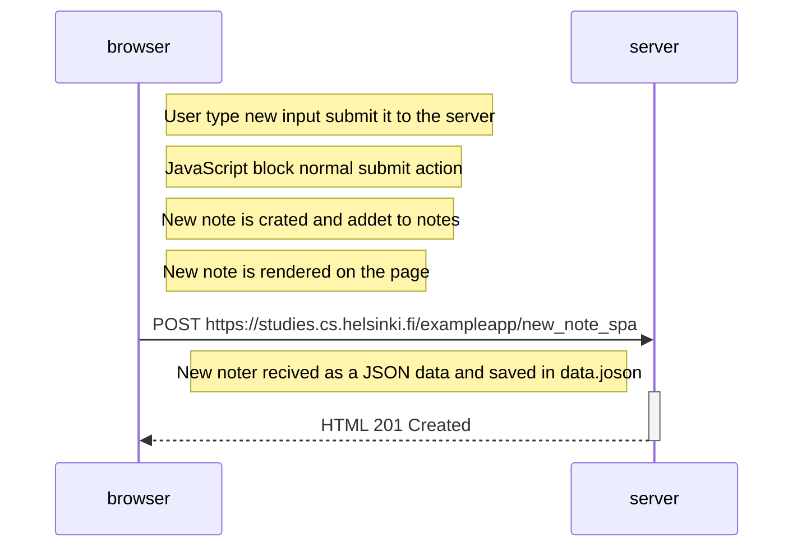

```mermaid
sequenceDiagram
    participant browser
    participant server

    Note right of browser: User type new input submit it to the server
    Note right of browser: JavaScript block normal submit action
    Note right of browser: New note is crated and addet to notes
    Note right of browser: New note is rendered on the page

    browser->>server: POST https://studies.cs.helsinki.fi/exampleapp/new_note_spa
   
    Note left of server: New noter recived as a JSON data and saved in data.joson
   
    activate server
    server-->>browser: HTML 201 Created
    deactivate server
```
